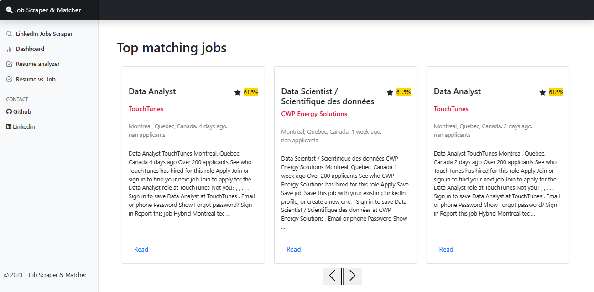
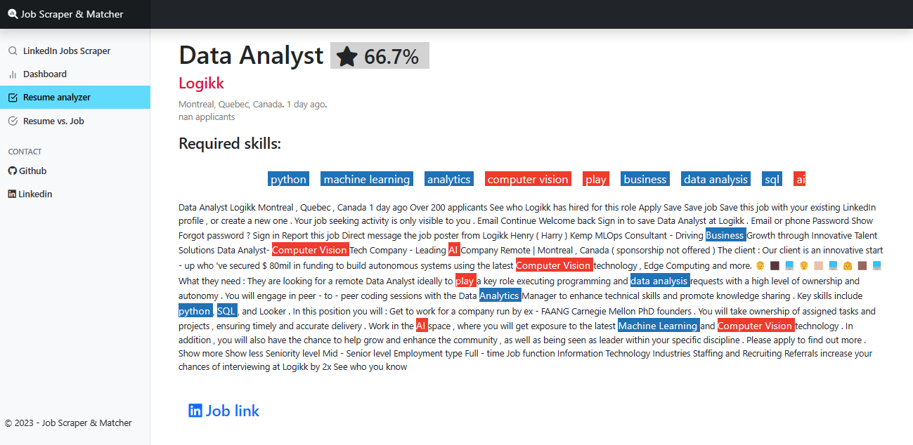

# LinkedIn Job Scraper and Matcher

### WEB scraping with Selinium and BeautifulSoup, NLP with Spacy and WEB app with Flask.

### Table of Contents

1. [Project Motivation](#motivation)
2. [Installation](#installation)
3. [File Descriptions](#file_descriptions)
4. [Instructions](#instructions)
5. [Flask application](#Flask_app)
6. [Acknowledgements](#Acknowledgements)

## Project Motivation 

If you're looking for a job, say a data science role, you're probably using Linkedin Jobs.
But with hundreds of jobs posted every day, it can be hard to find the ones that best match your skills.

The main purpose of this project is to help you find the best matching jobs automatically.

In this project we:

1. Built a Linkedin job scraper using `Selenium`, `Requests` and `BeautifulSoup`.
2. Built a text analysis of your resume and LinkedIn jobs using `Spacy`.
3. Developed a `Flask` app to display data visualisations, including a word cloud of in-demand skills. The app highlights job-specific skills and keywords, compares them to your skills and generates a list of the most relevant job matches.

## Installation 

This project requires Python 3 and the following Python libraries installed:

1. WEB scraping libraries: `Selenium`, `Requests`, `BeautifulSoup`
2. NLP libraries: `Spacy`, `NLTK`
3. Web app and visualization: `Flask`, `Plotly`, `Matplotlib`, `Wordcloud`
4. Other libraries: `pandas`, `numpy`, `json`

5. Install the trained English pipeline from Spacy.io as follows:
   `python -m spacy download en_core_web_lg `

The full list of requirements can be found in the `requirements.txt` file.

## File Descriptions 

- **FLASK_app** folder: contains our responsive Flask WEB application.
  - `run.py`: main file to run the web application.
  - `scraping_linkedin.py`: Code for scraping Linkedin jobs with `Selenium` and `Requests`, and `BeautifulSoup` for parsing html content.
  - `Spacy_text_analayzer.py`: Code to analyse text with `Spacy`, search for keywords and skills, compare them with your own and return the most relevant job matches.
  - `plotly_figures.py`: Returns the configuration (data and layout) of `Plotly` figures.
  - `templates` folder: Contains 9 html pages.
  - `static` folder: Contains our customized `CSS` file and `Bootstrap` (compiled and minified `CSS` bundles and `JS` plugins).
- **chromedriver** folder: contains the chromedriver executable used by `Selenium` to control Chrome.
- **data** folder: contains the following files:
  - `user_credentials.txt`: Contains your LinkedIn credentials (email address and password).
  - `Skills_in_Demand.txt`: List of skills in demand (you can update this list).
  - `Skill_patterns.jsonl`: Contains the skill patterns in json format and will be used to create an entity ruler in the `Spacy` model.
  - `Job_Ids.csv` and `linkedin_jobs_scraped.json`: Scraped LinkedIn job IDs and job details (description, seniority level, number of candidates, etc.).
- **notebooks** folder: contains the project notebooks.
- **resume** folder: Enter your resume (pdf format) here to analyse it with Spacy and get a list of your skills.

## Instructions 

1. Save your LinkedIn credentials (email address and password) in `user_credentials.txt`.

2. Run the following command in the FLASK_app's directory to scrape LinkedIn jobs.

   `python scraping_linkedin.py "data scientist" "Montreal, Quebec, Canada" 120`

   You can replace "Data Scientist" and "Montreal, Quebec, Canada" with the job title and the location, respectively.

   **120** is a timer set in seconds which allows for supplementary loading time for the webpage. The timer can be adjusted depending on your Internet speed.

3. Run the following command in the FLASK_app's directory to run the WEB application.

   `python run.py`

4. Go to http://127.0.0.1:3001/

## Flask application 

1. THe `Dashboard` page displays the distribution of seniority level and the number of days since the job posting. Additionally, it showcases a word cloud containing in-demand skills. This will help you define what you should be looking for to further broaden your skills.

   

2. The `Resume_Analyzer` page uploads your resume (pdf format), displays your skills and assesses them against the most in-demand skills.

   

3. The best matching jobs are showcased within a carousel that emphasises the matching scores.

   

4. The LinkedIn job role is presented on the `display_Job` page with an emphasis on the match score and highlighting essential skills required for the position that are not listed in your resume.

   

## Acknowledgements 
